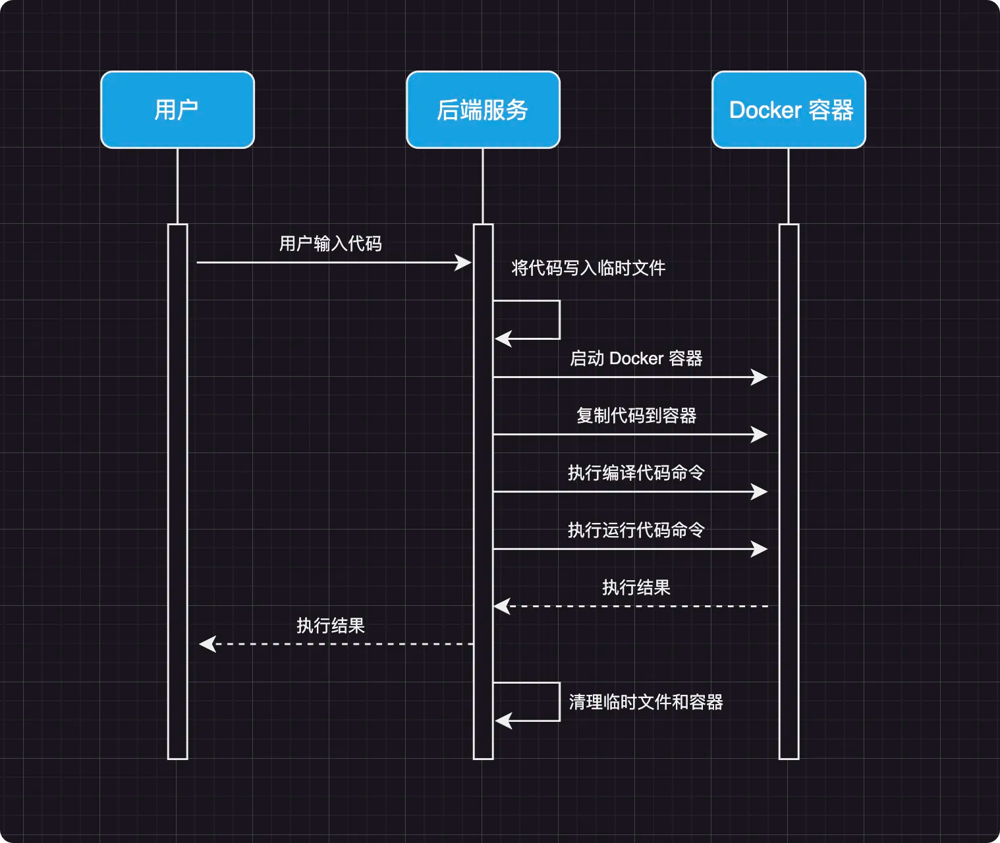

# 在线代码执行器
## 需求背景

在处理一些简单代码的时候，需要立即获得这段代码的执行结果，但是懒得打开 IDE 来运行。如果没有相应的环境，还需要配置环境、打开 IDE 来运行，会浪费大量时间，所以需要一个工具能在线执行常用的代码，运行各种常见的编程语言

不止要做一个在线代码执行器，还可以封装成一个 starter，让其他服务可以轻松的接入提供的代码执行器

## 技术选型

- Spring Boot 2.7.2
- docker-java 3.3.0
- Docker 容器隔离运行代码

## 业务流程
1. 用户输入代码
2. 后端将代码写入宿主机的临时文件中
3. 启动一个 Docker 容器
4. 将临时文件复制到容器中
5. 在容器中运行编译代码命令
6. 在容器中运行执行代码命令
7. 后端返回执行结果
8. 清理临时文件以及 Docker 容器



## 优点
### 容器池
借助池化思想，设计了一个容器池，进行资源预热，在请求量很大的情况下，超出系统可处理的请求，也可以在这个池子中等待，直到资源可用时继续从池子中取出；操作完成后容器可以复用，就避免了重复创建容器，销毁容器

### 优雅关闭
通过实现`ApplicationListener`接口，在关闭项目的时候删除容器和临时代码文件

## 使用

1、先在项目目录执行下面命令构建 Docker 镜像
```shell
docker build . -t codesandbox:latest
```

运行`mvn install`将项目安装到本地仓库

2、引入依赖

pom.xml

```xml
<dependency>
    <groupId>xyz.kbws</groupId>
    <artifactId>oj-code-sandbox</artifactId>
    <version>1.0</version>
</dependency>
```

3、配置文件添加配置
```yaml
codesandbox:
  config:
    image-name: codesandbox:latest
    timeout-limit: 7
    time-unit: seconds
    memory-limit: 62914560
    memory-swap: 0
    cpu-count: 1
  pool:
    core-pool-size: 20
    maximum-pool-size: 50
    wait-queue-size: 100
    keep-alive-time: 8
    time-unit: seconds
```